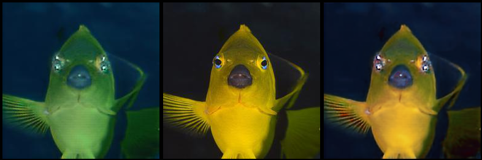
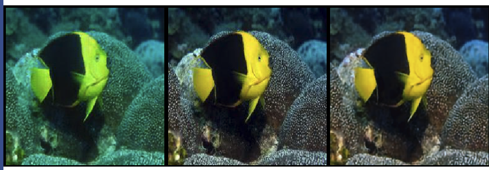
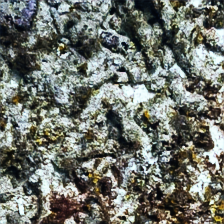
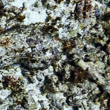
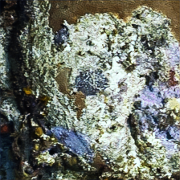

# Reefs Colour Enhancement Group

- Jaka Cikač  
- Harits Abdurrohman

## Intro

Underwater image enhancement has attracted much attention due to the rise of marine resource development in recent years. Fruitpunch held Coral Reef Challenge to help marine research with AI as a tool. Composed by three separate task, this group focused on colour enhancement.

Previously we ..

- histogram equalizer
- CLAHE
- Underwater CNN
- proposed some idea like using GAN or NeRF


... And after several experiment, we got the best approach for this task: Underwater Image Enhancement Convolution Neural Network using 2 Color Space (UIEC<sup>2</sup>Net).


UIEC<sup>2</sup>Net is an end-to-end model that using RGB and HSV color space to enhance underwater image. It has three main blocks:
1. RGB pixel-level block to denoising and removing color cast
2. HSV global adjust block to adjust underwater image lighting (including color and saturation) globally
3. Attention block for combining these two blocks output images

```bibtex
@article{DBLP:journals/corr/abs-2103-07138,
  author    = {Yudong Wang and
               Jichang Guo and
               Huan Gao and
               HuiHui Yue},
  title     = {UIEC{\^{}}2-Net: CNN-based Underwater Image Enhancement Using Two
               Color Space},
  journal   = {CoRR},
  volume    = {abs/2103.07138},
  year      = {2021},
  url       = {https://arxiv.org/abs/2103.07138},
  eprinttype = {arXiv},
  eprint    = {2103.07138},
  timestamp = {Tue, 23 Mar 2021 16:29:47 +0100},
  biburl    = {https://dblp.org/rec/journals/corr/abs-2103-07138.bib},
  bibsource = {dblp computer science bibliography, https://dblp.org}
}
```

## Implementation

We trained the model from [modified code from original author](https://github.com/JakaCikac/UWEnhancement) using [EUVP (Enhancing Underwater Visual Perception) dataset](http://irvlab.cs.umn.edu/resources/euvp-dataset). We did purposely train the model with Underwater ImageNet from EUVP since it has more natural underwater image than Underwater Dark and Underwater Scene. After 100 epochs, the result seems quite promising and we start to move to the coral image (ATL dataset).

Here's some of the result from Underwater ImageNet: 
_(Left to Right: Input image, Ground Truth, Output image)_
.png)
.png)



Result using coral images:





## Try yourself

We store the model on a container (_don't worry, I got this for free from my campus - Harits_) so you can try yourself.